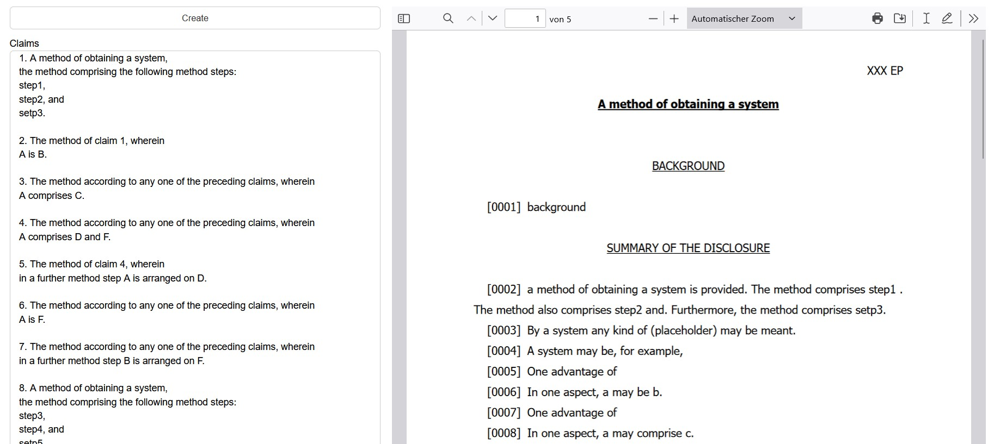

# PatentTrainingHub
The repository is intended to host materials, code, or resources related to patent training or education.

## patent machine

Patent machine is my first apporach of a patent drafting tool.

You can input the claims in a text field and automatically generate a patent application (word and pdf document).




### How to run patent machine

Run following consol command:

```
panel serve patent_machine.ipynb --autoreload
```

